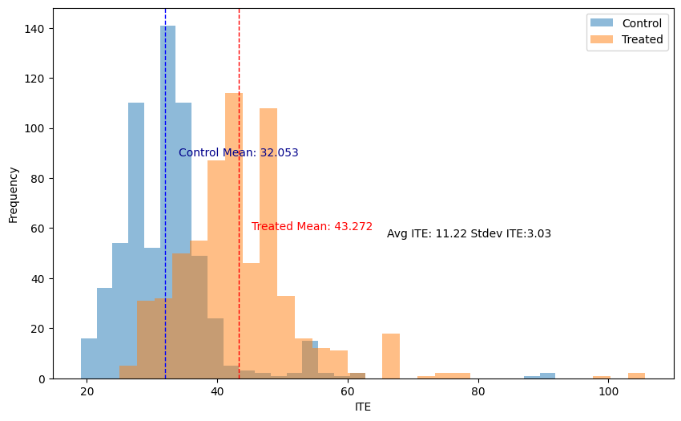

# bartCausePy

A Python wrapper of [bartCause](https://github.com/vdorie/bartCause)(Causal Inference using Bayesian Additive Regression Trees) authored by [Vincent Dorie](https://github.com/vdorie/bartCause). 



#### Requirements

* Python>=3.8
* rpy2>=3.5.0
* numpy>=1.24.0
* pandas>=2.0.0
* scikit-learn>=1.3.2

#### Get Started

```
git clone https://github.com/yanmluk/bartCausePy.git
cd bartCausePy
python hello_world.py
```